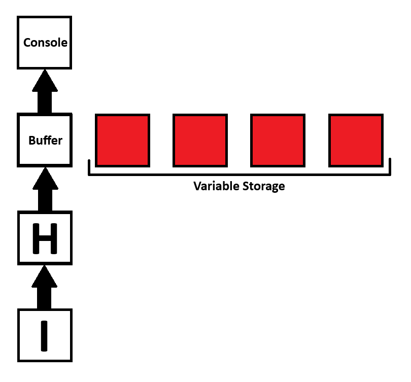

# BrainLessFK
 Script in a easy to use Basic style language then compile to BrainFK code.
 ## Utility:
Upon cloning project, you can add scripts to the scripts directory then pass in the path in as an argument. The program will then return the BrainFK code (unless an error occurs) which you could compile using a [BrainFK compiler](https://www.tutorialspoint.com/execute_brainfk_online.php).

To run example script, cd into root directory of project then run `cargo run "./scripts/test.blf"`.
## Commands:
### Command table:
| Command | Description | Argument 1 | Argument 2 | Argument 3 |
| - | - | - | - | - |
| def | defines variable | type | name | value (or length) |
| print | prints value | type | value |
### Example:
```py
def input first_name 6  # defines a string named first_name with a value found in input of length 6 (if name is shorter, _ the remaining time and if it is longer then paraphrase)
def char return 13  # defines a character named return with a value of 13 (ascii of carriage return)

def str money "$504.27"  # defines a string named money with a value of "$504.27"

print str "Hello "  # prints a string with the value of "Hello "
print var first_name  # prints a variable named name
print str ","  # prints a string with the value of ","
print var return  # prints a variable named name

print str "you currently have "  # prints a string with the value of "you currently have "
print var money  # prints a variable named money
print str " in your bank account."  # prints a stromg with the value of " in your bank account."
```
#### compiles to:
```
>,>,>,>,>,>,>+++++++++++++>++++++++++++++++++++++++++++++++++++>+++++++++++++++++++++++++++++++++++++++++++++++++++++>++++++++++++++++++++++++++++++++++++++++++++++++>++++++++++++++++++++++++++++++++++++++++++++++++++++>++++++++++++++++++++++++++++++++++++++++++++++>++++++++++++++++++++++++++++++++++++++++++++++++++>+++++++++++++++++++++++++++++++++++++++++++++++++++++++<<<<<<<<<<<<<<++++++++++++++++++++++++++++++++++++++++++++++++++++++++++++++++++++++++.+++++++++++++++++++++++++++++.+++++++..+++.-------------------------------------------------------------------------------.>.>.>.>.>.>.<<<<<<++++++++++++.>>>>>>>.<<<<<<<+++++++++++++++++++++++++++++++++++++++++++++++++++++++++++++++++++++++++++++.----------.++++++.-------------------------------------------------------------------------------------.+++++++++++++++++++++++++++++++++++++++++++++++++++++++++++++++++++.++++++++++++++++++.---..-------------.+++++++++.++++++.--------.+++++++++++++.-----------------------------------------------------------------------------------------.++++++++++++++++++++++++++++++++++++++++++++++++++++++++++++++++++++++++.-------.+++++++++++++++++++++.-----------------.---------------------------------------------------------------------.>>>>>>>>.>.>.>.>.>.>.<<<<<<<<<<<<<<.+++++++++++++++++++++++++++++++++++++++++++++++++++++++++++++++++++++++++.+++++.------------------------------------------------------------------------------.+++++++++++++++++++++++++++++++++++++++++++++++++++++++++++++++++++++++++++++++++++++++++.----------.++++++.---.----------------------------------------------------------------------------------.++++++++++++++++++++++++++++++++++++++++++++++++++++++++++++++++++.-.+++++++++++++.---.---------------------------------------------------------------------------.+++++++++++++++++++++++++++++++++++++++++++++++++++++++++++++++++.++..++++++++++++.++++++.-------.++++++.----------------------------------------------------------------------.
```
#### which then outputs:
```
Hello <first_name>,
you currently have $504.27 in your bank account.
```
## BrainFK Logic:
[BrainFK](https://en.wikipedia.org/wiki/Brainfuck) is a minimalist esoteric programming language designed to challenge programmers and showcase the fundamentals of computing. Created in 1993 by Urban Müller, it consists of only eight commands: `>`, `<`, `+`, `-`, `[`, `]`, `.`, and `,`. These commands manipulate a simple array of 30,000 memory cells and provide basic looping and input/output functionality. BrainFK programs are often written in a terse, cryptic style, making them both challenging to write and decipher. Despite its simplicity, BrainFK is Turing-complete, meaning it can compute anything that can be computed algorithmically, albeit with considerable effort. It's primarily used for educational purposes, code golfing, and as a mental exercise for programmers.


In this visualization, the squares act as memory cells within the array. The underline is the pointer (or index of array) and the `>` or `<` popping up below are the commands within the code. As you can see when you type `>` it moves the pointer right and when you type `<` it moves the pointer left.

In order to interact with the values of the array `+`, `-`, `.`, and `,` are used. You can also interact with the data using `[` and `]` in order to make loops but I wont be touching on that throughout this project. To begin, the memory cell stores an integer which can be from 0 to 255. The `+` and `-` are using to add and subtract from the memory cell that the pointer is selecting. The `.` then prints the memory cell as a character by converting the integer to it's ASCII value. The `,` takes an input of an ASCII character and converts it to its decimal format.

### ASCII Table:
| DEC | CHAR |  | DEC | CHAR |  | DEC | CHAR  |  | DEC | CHAR |  | DEC | CHAR |  | DEC | CHAR |  | DEC | CHAR |  | DEC | CHAR |
|-----|------|--|-----|------|--|-----|-------|--|-----|------|--|-----|------|--|-----|------|--|-----|------|--|-----|------|
|   0 | NULL |  |  16 | DLE  |  |  32 | SPACE |  |  48 | 0    |  |  64 | @    |  |  80 | P    |  |  96 | `    |  | 112 | p    |
|   1 | SOH  |  |  17 | DC1  |  |  33 | !     |  |  49 | 1    |  |  65 | A    |  |  81 | Q    |  |  97 | a    |  | 113 | q    |
|   2 | STX  |  |  18 | DC2  |  |  34 | "     |  |  50 | 2    |  |  66 | B    |  |  82 | R    |  |  98 | b    |  | 114 | r    |
|   3 | ETX  |  |  19 | DC3  |  |  35 | #     |  |  51 | 3    |  |  67 | C    |  |  83 | S    |  |  99 | c    |  | 115 | s    |
|   4 | EOT  |  |  20 | DC4  |  |  36 | $     |  |  52 | 4    |  |  68 | D    |  |  84 | T    |  | 100 | d    |  | 116 | t    |
|   5 | ENQ  |  |  21 | NAK  |  |  37 | %     |  |  53 | 5    |  |  69 | E    |  |  85 | U    |  | 101 | e    |  | 117 | u    |
|   6 | ACK  |  |  22 | SYN  |  |  38 | &     |  |  54 | 6    |  |  70 | F    |  |  86 | V    |  | 102 | f    |  | 118 | v    |
|   7 | BEL  |  |  23 | ETB  |  |  39 | '     |  |  55 | 7    |  |  71 | G    |  |  87 | W    |  | 103 | g    |  | 119 | w    |
|   8 | BS   |  |  24 | CAN  |  |  40 | (     |  |  56 | 8    |  |  72 | H    |  |  88 | X    |  | 104 | h    |  | 120 | x    |
|   9 | HT   |  |  25 | EM   |  |  41 | )     |  |  57 | 9    |  |  73 | I    |  |  89 | Y    |  | 105 | i    |  | 121 | y    |
|  10 | LF   |  |  26 | SUB  |  |  42 | *     |  |  58 | :    |  |  74 | J    |  |  90 | Z    |  | 106 | j    |  | 122 | z    |
|  11 | VT   |  |  27 | ESC  |  |  43 | +     |  |  59 | ;    |  |  75 | K    |  |  91 | [    |  | 107 | k    |  | 123 | {    |
|  12 | FF   |  |  28 | FS   |  |  44 | ,     |  |  60 | <    |  |  76 | L    |  |  92 | \    |  | 108 | l    |  | 124 | &#124; |
|  13 | CR   |  |  29 | GS   |  |  45 | -     |  |  61 | =    |  |  77 | M    |  |  93 | ]    |  | 109 | m    |  | 125 | }    |
|  14 | SO   |  |  30 | RS   |  |  46 | .     |  |  62 | >    |  |  78 | N    |  |  94 | ^    |  | 110 | n    |  | 126 | ~    |
|  15 | SI   |  |  31 | US   |  |  47 | /     |  |  63 | ?    |  |  79 | O    |  |  95 | _    |  | 111 | o    |  | 127 | DEL  |

In this table, it shows the decimal to character conversions using the ASCII conversions. Notice how the first 32 along with 127 are words instead of characters, this is because they arn't visual characters but instead instruct the computer as to how to handle certain information. As you can see this table only goes up to 127, this is due to it being the standard ASCII table. BrainFK allows you to go up to 255 by using the extended ASCII table.

### Example:
The code `+++++++++++++++++++++++++++++++++.` (33 pluses) would output the character of decimal `33` which equals to `!`. If I then were to append `>++++++++++++++++++++++++++++++++++.` (34 pluses) to the end of it the program would output `!"` and the array of values would look like `[!, "]` in character format or `[33, 34]` in numeric format. In reality though you wouldn't need to store these two values in seperate memory cells so writing `+++++++++++++++++++++++++++++++++.+.` (33 pluses followed by a period then another plus) would yeild the same output.

## BrainLessFK Logic:
BrainLessFK is a scripting language with [BASIC](https://en.wikipedia.org/wiki/BASIC)-like formatting, designed to compile into BrainFK. Its compiler is written in [Rust](https://en.wikipedia.org/wiki/Rust_(programming_language)), offering a simplified approach to BrainFK programming.

### Script Parsing:
The compiler parses the script inputted by splitting it into individual lines and then splitting it again into each individual argument. It then simply uses a match statement to properly use the correct commands.
```rs
// script located at: src/parse_script.rs
...
impl VecStrExtensions for Vec<&str> {
    /// Executes each argument in vector.
    fn exec_command(&mut self, pointer: &mut Pointer) {
        if self.len() == 0 {
            return;
        }
        match self[0] {
            "def" => {
                match self[1] {
                    "char" => pointer.def_var(self[2], Value::U8(self[3].parse::<u8>().expect("Invalid u8"))),
                    "str" => pointer.def_var(self[2], Value::Str(self[3])),
                    "input" => pointer.get_input(self[3].parse().expect(&format!("Invalid length of input: {}", self[3])), self[2]),
                    arg => panic!("Invalid def argument: {}", arg),
                }
            },
            "print" => {
                match self[1] {
                    "var" => pointer.print_var(self[2]),
                    "str" => pointer.print_str(self[2]),
                    "char" => {
                        let value: u8 = self[2].parse().unwrap();
                        pointer.print_char(value as char);
                    },
                    arg => panic!("Invalid print argument: {}", arg),
                }
            }
            command => panic!("Invalid command: {}", command),
        }
    }
}
```
As you can see in the code chunk provided above, it takes in self (which is the vector of a single lines command and arguments [command, argument 1, argument 2...]) then executes the proper function corresponding with the command and arguments. Each line in the script is then iterated through with this method called upon them.
### Pointer Object:
The main goal of the pointer object is to track the movements of the program. This can then be used later to properly handle data and indexing.
```rs
// script located at: src/parse_script.rs

pub enum StackValue {
    Char(char),
    Var(bool)
}

struct Pointer {
    index: u16,
    stack: Vec<StackValue>,
    occupied_index: u16,
    var_registry: HashMap::<String, Range<u16>>
}

fn main() {
    let mut pointer = Pointer {
        index: 0,
        stack: vec![StackValue::Char(0 as char); 30_000],
        occupied_index: 1,
        var_registry: HashMap::new(),
    };
...
```
As you can see, pointer is assigned in the root of main, this is because the program only needs one and that the pointer object is used throughout the program. In terms of memory management, this means that pointer is forever going to be in scope (unless the value is passed somewhere else). 

Each item in pointer has a designated value and purpose. Firstly, index is where the current pointers index is in the program. This means that at any point, if the program outputs `>` it will increment the index by one and if it outputs `<` it will decrement the index by one. Stack is an array of the assigned values which mimicks the array in BrainFK. It can contain either a character named Char or a bool named Var. This is useful because if the compiler doesnt know the current value of the program, it has to handle assignments differently. The occupied index is similar to the index but instead of marking where the pointer is currently located, it marks first availible location to append new data too. This is important so when I assign future values it doesnt overwrite past ones. Lastly the var registry is a hashmap which stores the variable names as keys and the range to the memory array as values. This means that even if the value changes in the memory array, no altering would have to be done to the registry to properly track the values.

### Printing String Literals:
In order to indicate that your printing a string literal, you'd have to feed in `str` as the first argument. Printing string literals work interestingly because they are never actually stored within the memory, but instead streamed through the buffer (which is the memory cell with an index of 0). This is done by iterating through each character in the string and feeding it through the buffer, then printing it. 


In this visualization, It shows the brainFK memory cell array. It shows how it streams the string literals through the buffer which is then printed which the variables are stored alongside it. When ran, the logic shown in the visualization would output `HI`.

### Variable storage:


e

e

e

e

e

e

e

e

e

e

e

e

e

e

e

e

e

e

e

e

e

e

e
